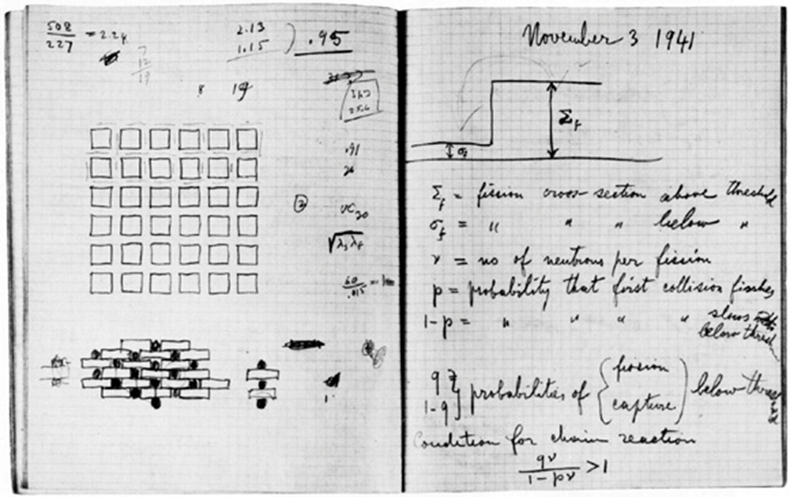

:author: Juergen Hasch
:email: juergen.hasch@elbonia.de

------------------------------------------
Using the IPython Notebook as Lab Notebook
------------------------------------------

.. class:: abstract

The IPython (Jupyter) notebook comes very close to the ideal electronic version of an engineer’s lab notebook. 
It is easy to use, allows combining text, formulas, graphics, plots and tables, can do live calculations, 
and can be used to generate static documentation. Customizing the notebook with extensions significantly improves the workflow.

.. class:: keywords

  IPython, Jupyter

Motivation
------------
According to Wikipedia, lab notebook is a primary record of research (https://en.wikipedia.org/wiki/Lab_notebook ).
Scientists and engineers keep a lab notebook to write down new ideas, do simple calculation or document measurements. 
Before computers, it was the single most important tool, and it still is the primary means of documentation. 
The picture shows a page of Enrico Fermi's lab notebook:

Entries in a lab notebook typically contain a heading, the current date, text, tables, math, drawings, and calculations. 
As computers have become an integral part of research and engineering, having a computer-based tool that essentially allows 
the same workflow as with a handwritten lab note-book becomes inevitable. The proper tool…
 * Is easy to use (think pencil and paper)
 * Can do text, formulas, graphics, plots, tables
 * Can do calculations
 * Can be reused
 * Is useful for documentation

Computer Tools
---------------
Word: The main tool being used even nowadays is Microsoft Word. 
Shocking but true. For calculations and generating plots, additional tools like Matlab are used.
Mathematica: A powerful tool geared towards mathe-matical formulation of problems. It is not easy to use (think: pencil and paper), 
unless one spends considerable time learning it.
Mathcad: Explicitly designed as engineering tool. Allows putting in formulas in mathematical notation and doing actual calculations. 
My experience: Limited capabilities, closed to the outside world, bugs.
IPython notebook: Allows combining text, formulas, and graphics. And gives you the power if Python. 

The Python Ecosystem
---------------
So what makes Python and the IPython notebook a good choice ?
Python is a modern general-purpose language with a focus on making it fast and easy to use. 
The ecosystem: There's a package for that! For mathematics, plotting, optimization, data formats, internet protocols.
The notebook frontend running in a web browser.
The extensibility: IPython extensions allow adding functionality to the interpreter and the frontend

Customization
---------------
 
 
Acknowledgments
---------------

References
----------
.. [Bay15] M Bayer.  *Mako: Templates for Python*. http://www.makotemplates.org

.. [Col13] A Collette. *Python and HDF5: Unlocking Scientific Data*. O'Reilly Media, 2013.

https://github.com/ipython-contrib/IPython-notebook-extensions
https://github.com/juhasch/PhysicalQuantities
