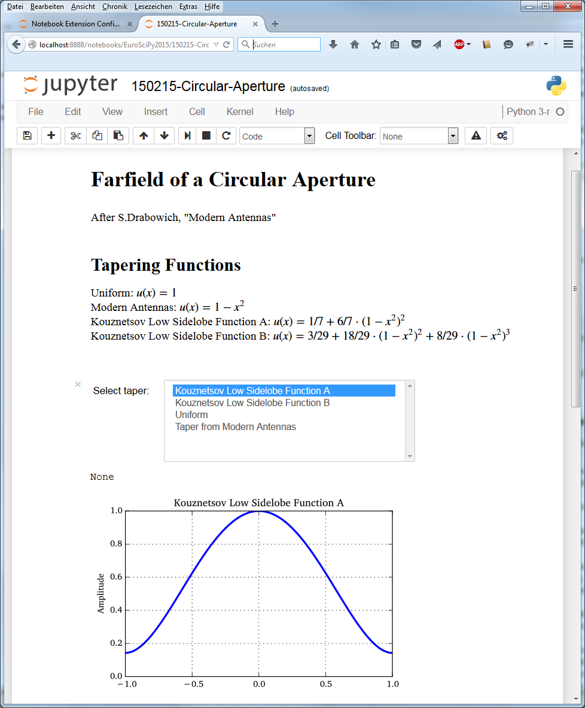

:author: Juergen Hasch
:email: juergen.hasch@elbonia.de
:institution: https://github.com/ipython-contrib

------------------------------------------
Using the IPython Notebook as Lab Notebook
------------------------------------------

.. class:: abstract

A paper lab notebook is often the most important tool for an engineer or scientist. The IPython (Jupyter) notebook
has the potential to complement, if not sometimes replace the lab notebook.
It is easy to use, allows combining text, formulas, graphics, plots and tables, can do live calculations,
and can be used to generate static documentation.
The countless available Python packages provide support for a large number of tasks and the extensibility of the notebook with
extensions can significantly improve the workflow.

.. class:: keywords

  IPython, Jupyter

Motivation
----------
According to Wikipedia, a lab notebook is the primary record of research.
Scientists and engineers keep a lab notebook to write down new ideas, do calculation, or document measurements.
Before computers, it was the single most important tool for doing calculations, and it still is the first means of documentation.
Figure 1 shows a page of Enrico Fermi's lab notebook as an example.

.. figure:: fermi.jpg

    Enrico Fermi's lab notebook (Source: Wikipedia)

Entries in a lab notebook typically contain a heading, the current date, text, tables, math, drawings, and calculations.
As computers have become an integral part of research and engineering, having a computer-based tool that essentially allows
the same workflow a handwritten lab notebook allows becomes desirable. A suitable tool has to fulfill serveral requirements:

* It needs to be extremely easy to learn and use (think of pencil and paper!).
* It allows the combination of text, formulas, graphics, plots, and tables.
* It can do calculations and updates generated plots and tables.
* It is useful for documentation, but not necessarily a publication-quality tool.
* The tool follows the user's workflow, not the other way around.

Computer Tools
--------------
So what are people currently using ?

* Microsoft Word: The main "tool" being used even nowadays is Microsoft Word. Shocking but true. For calculations and generating plots, additional tools like Matlab are used.
* Mathematica: A powerful tool geared towards mathematical formulation of problems. It is not easy to use, unless one has spent considerable time learning it.
* Mathcad: Explicitly designed as engineering tool. Mostly easy to learn and use. Allows entering formulas in mathematical notation and doing actual calculations. Personal experience: Limited capabilities, closed to the outside world, not very powerful wehen doing more than calculations of limited complexity.
* Jupyter/IPython notebook: Easy to use. Allows combining text, formulas, and graphics. And gives you the power of Python.

The Python Ecosystem
--------------------
So what makes Python and the Jupyter/IPython notebook a good choice ?

* Python is a modern general-purpose language with a focus on being easy to use and being very open to interfacing other languages.
* The ecosystem: There's a package for that! For mathematics, plotting, optimization, data formats, internet protocols. Most of the available packagages have been put on a social coding platform, allowing inspection, feedback, and collective improvement of those packages.
* The notebook frontend is running in a web browser, making the user feel right at home and giving him access to the latest web visualization technologies. A screenshot is shown in Figure 2.
* The extensibility: IPython extensions for the frontend (i.e. the Browser), the backend (i.e. the notebook server), and export templates allow adding functionality, and customizing the tool to the user's individual needs.

    The Jupyter/IPython notebook

Extension and Customization
---------------------------
To extend or customize the notebook workflow, there are a number of different ways provided to modify or extend the functionality of the notebook without requiring to deal with the internals:

* *IPython extensions* add functionality when using the Python language itself. Examples are magics like `%timeit` to time the execution of commands, or extensions that hook into the `InputTransformer`, like the PhysicalQuantities package [PhQ]. This package allows calculating with physical units, i.e. saying ` 20 m / 15 s` to specify a velocity.
* *Notebook frontend extensions* written in Javascript allow extending the frontend functionality of the notebook. Examples range from simple things like changing keyboard hotkeys, to more complex ones like providing latex commands in markdown cells.
* *Notebook server extensions* for adding new functionality to the notebook server itself. An example for this is the `nbconfig` extension, that allows activating/decativating and configuring Javascript notebook extensions.
* *Templates*, *pre-* and *postprocessors* allow the user to customize conversion to other formats like html, rst or tex.

IPython extensions
------------------
One example of IPython extensions already mentioned is the PhysicalQuantities module [PhQ]. It allows entering values together with physical units
directly in Python code, as shown in Figure 3. This is done using the IPython `StatelessInputTransformer`. There, all occurances of units are replaced
with a valid Python function call. So `1 m/s` get replaced by a call to `PhysicalQuantity(1, 'm/s')`.

    Units in Python calculations

Notebook frontend extensions
----------------------------

Notebook frondent equations are written in Javascript, as they run in the Browser. They can improve the usability or add
new functionality. Here is a small list of notebook frontend extensions that are available at the `IPython-contrib` repository [IPc]:

* *Codefolding* allows folding of code blocks, for example only displaying the function definition, hiding the the rest of the code.
* *ExecuteTime* shows the time it took to execute a code cell in the output area below the cell.
* *LaTeX environments* enables using a number of LaTeX commands and environments in the notebook's markdown cells.
* *Limit Output*  limits the number of characters that can be sent to the output area when executing a cell. This prevents deadlocks when unintentionally entering an infinite loop of print commands.
* *Navigation Hotkeys* adds additional hotkeys, like *pageup* and *pagedown* moving the cell selection in command mode, and modifies other hotkeys like *ctrl-enter* to execute a cell and go to the next cell directly in edit mode.
* *Python Markdown* executes Phython code in a markdown cell. This comes very handy for displaying computation results in a markdown cell, allowing a more natural embedding of computation results with text and math. The Python command is only executed when the markdown cell is newly rendered.
* *Ruler* displays a visible ruler at a given column in a codecell, giving a visual clue for example when text reaches column.
* *Skip-Traceback* hides tracebacks and only displays the error message. Often tracebacks present too much information to the user where a simple error message would be sufficient (like *file not found*). The tracebacks can be activated again by pressing an icon on the toolbar.
* *Runtools* provide a number of additional functions for working with code cells in the IPython notebook. It allows executing parts or the complete notebook, selectively hiding code cells or code cell output, and allows locking them.

Notebook server extensions
--------------------------

To easily activate, deactivate and configure the notebook frontend extensions, a server extension was written, that can
be called by going to the `/nbextensions` page in the Browser. This displays the page shown in Figure 4.

    Notebook extensions configuration page

Examples
--------

Figure 2 has already shown code cells can be hidden, so only the output is shown using the *Runtools* extension.
The next example describes the calculation of a simple electrical RC circuit. It makes use of several extensions.
First, it uses the *PhysicalQuantities* package with the corresponding IPython extensions to allow using physical units.
As Python 3 is used, unicode variables like :math:`\rho` can be used.

To display calculation results in markdown cells, the *Python markdown extension* is used. The syntax for adding Python commands
to a markdown cell is embedding them in double curly braces: `{{ command }}`. Here is an example:

    `Initial current is $i_0$ = {{ i0.uA }}`.

The output of the given Python command is the displayed in the markdown cell.

Finally, the codefolding extension is enabled in this example, which can be seen by the gutter element on the left side
of each code cell. As there is nothing to fold, the gutter is always empty in this case.

..

..

..

.. image:: rc3.png
   :align: left

Conclusion
----------
The Jupyter/IPython notebook has become a valuable tool for scientists and engineers.
Through it's extensibility, it can be customized to be extremely efficient and easy to use for daily work.
Some wishes remain, however. These include a hierarchy to hide parts of a notebook document, easy diffing and version
control, better support for exporting notebooks to a high-quality document format, an improved way to
organize  many notebooks, and a way to directly sketch drawings within a notebook.

References
----------
.. [IPc] *Notebook extensions for Jupyter*. https://github.com/ipython-contrib/IPython-notebook-extensions

.. [PhQ] *PhysicalQuantities: Units in Python*. https://github.com/juhasch/PhysicalQuantities

